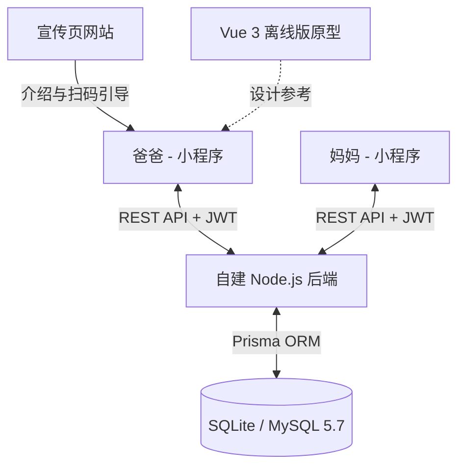

# 围兜日记 | 智能宝宝辅食与健康协同管理系统

一个专为宝宝（特别是早产/成长需要精细化照顾的宝宝）健康成长研发的**多端协同家庭管理系统**。支持多设备/多家庭成员实时同步、智能辅食排餐与合规校验、疫苗滚动日程算、儿保就诊病历归档、以及视力遮盖与日常指标打卡。

项目已彻底从原“微信云开发”迁移至自建高可用后端，提供完整的客户端-服务端闭环服务。

---

## 🛑 数据敏感与纯净规则
1. **严禁随意更改 `docs/03_miniprogram_frontend/db_seeds/` 目录下的 JSON 种子数据**：该目录内包含用户本人的真实医疗、儿保及辅食历史记录，作为系统部署和首次导入的原始数据。
2. **脱敏规则**：微信小程序内置的本地缓存默认数据已做脱敏处理，禁止将包含真实名字、医院病历敏感信息的明文硬编码至公开逻辑中。

---

## 🏗️ 整体系统架构与技术栈

本系统采用现代化的前后端分离架构，主要由以下四个子项目组成：



### 1. 自建 Node.js 服务端 (`/backend`)
*   **核心框架**：Node.js (Express)
*   **数据库 ORM**：Prisma Client
*   **数据库支持**：默认使用 SQLite 保证本地零配置快速开发验证；可通过环境变量无损切换至 MySQL 5.7 生产库。
*   **鉴权机制**：双 JWT Token (Access Token 2小时有效，Refresh Token 30天长效无感刷新) + 微信官方 `jscode2session` 登录授权。
*   **同步引擎**：物理增量同步接口 `/sync/pull` 与 `/sync/push`，支持秒级增量合并、设备版本比对和防并发事务冲突。

### 2. 微信小程序客户端 (`/wx_miniprogram`)
*   **开发模式**：原生微信小程序 (摒弃了 `wx.cloud` 依赖)。
*   **网络封装**：自研 `utils/request.js`，支持静默重试、401 无感 Token 静默刷新队列，保障看护人在日常使用时不会因登录过期产生卡顿。
*   **核心页面**：
    *   `pages/dashboard`：今日护理环形进度仪表盘、儿保疫苗就诊预警栏。
    *   `pages/mealplan`：每周排餐食谱制定、智能红黄绿灯配餐校验。
    *   `pages/family`：家庭管理中心，提供邀请成员、解绑、多设备协同入口。
    *   `pages/my`：个人设定、计步器及计时配置、开发者数据一键导入。

### 3. 宣传页网站 (`/website`)
*   **技术实现**：HTML5 + CSS3 + 纯 JavaScript (无框架依赖，高性能轻量化)。
*   **设计亮点**：3D 黏土暖色风格 UI 资产，具备自适应布局，支持扫码引导及在线“今日数据更新”交互体验。

### 4. 离线网页版原型 (`/src` & `/public`)
*   **技术实现**：Vue 3 + Vite + LocalStorage
*   **定位**：作为纯前端离线辅助工具及桌面端交互的原型参考。

---

## 📁 目录结构说明

```text
BabyComplementaryFoods/
├── backend/                  # 自建 Node.js 后端服务端
│   ├── prisma/               # Prisma 数据库 Schema 与迁移记录
│   ├── src/                  # 服务端源码 (App, 路由, 控制器, 服务层)
│   └── .env                  # 服务端本地环境变量配置文件
├── wx_miniprogram/           # 微信小程序前端项目
│   ├── pages/                # 小程序页面 (dashboard, mealplan, my 等)
│   ├── utils/                # 工具库 (request.js 请求库, storage.js 本地同步引擎)
│   └── app.js                # 小程序入口
├── website/                  # 宣传页官方网站
│   ├── assets/               # 渲染图与二维码 mock 美术资产
│   ├── index.html            # 宣传页主 HTML
│   ├── style.css             # 宣传页 CSS
│   └── app.js                # 宣传页交互逻辑
├── docs/                     # 分类整理后的系统文档中心
│   ├── 01_meal_planning/     # 辅食排餐规则、食材池说明
│   ├── 02_backend_server/    # 数据库设计、后端三层架构、REST API 说明、增量同步指南
│   ├── 03_miniprogram_frontend/ # 小程序前端开发记录与 classes.json 等核心种子数据
│   ├── 04_specs_and_guidelines/ # 系统详细功能需求大纲说明书
│   └── README.md             # 文档中心总索引指南
├── src/                      # Vue 3 原型开发源码
├── package.json              # 根目录配置
└── README.md                 # 本 README 文件
```

---

## 🚀 快速本地部署与运行指南

### 后端服务启动
1. 进入 `/backend` 目录，安装依赖：
   ```bash
   cd backend
   npm install
   ```
2. 推送 Schema 并创建本地 SQLite 数据库：
   ```bash
   npx prisma db push
   ```
3. 运行开发服务器：
   ```bash
   npm run dev
   ```
   *运行成功后会在 `http://localhost:3000` 侦听请求。*

### 微信小程序调试
1. 使用 **微信开发者工具** 打开根目录下的 `wx_miniprogram` 文件夹。
2. 在工具的“本地设置”中，**勾选“不校验合法域名、web-view（业务域名）、TLS 版本以及 HTTPS 证书”**（以允许小程序向本地 `http://localhost:3000` 发起网络请求）。
3. 调起授权登录，即可直接和本地的 Express 后端数据库连通并体验多端同步。

### 宣传页网站浏览
1. 直接在浏览器中双击打开 `website/index.html` 即可访问高端暖色调的官网。
2. 或在根目录下运行前端服务：
   ```bash
   npm run dev
   ```
   并通过输出的 Vite 本地链接进行访问。
