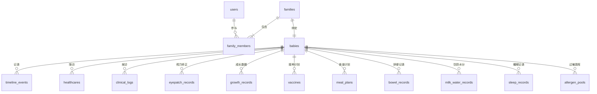

# 数据库设计方案 (Database Schema)

本设计方案将原微信云开发中的 NoSQL 集合结构转换为规范的 **MySQL 5.7 关系型数据库** 表结构，并在应用层使用 ORM（推荐 **Prisma** 或 **Sequelize**）进行对象关系映射。

---

## 一、 E-R 关系图 (Entity-Relationship Diagram)

以下是“围兜日记”系统的核心实体关系图：



---

## 二、 核心数据库表设计 (Table Schema)

为了保证微信生态对接的自然过渡，我们将微信 `openid` 作为用户表的主键（或建立唯一索引的业务键），同时针对高并发查询，对时间、关联 ID 建立合理的索引。

### 1. 用户表 (users)
* **说明**：存储授权登录的看护人微信基础信息。

| 字段名 | 类型 | 约束 | 默认值 | 索引 | 中文注释 |
| :--- | :--- | :--- | :--- | :--- | :--- |
| `openid` | `VARCHAR(64)` | `PRIMARY KEY` | - | - | 微信用户唯一标识 |
| `unionid` | `VARCHAR(64)` | `NULL` | `NULL` | `UNIQUE` | 微信开放平台唯一标识 |
| `nickname` | `VARCHAR(100)` | `NOT NULL` | `'看护人'` | - | 微信用户昵称 |
| `avatar_url` | `VARCHAR(512)` | `NULL` | `NULL` | - | 头像链接（支持云存储 fileID 或 HTTPS 链接） |
| `created_at` | `DATETIME` | `NOT NULL` | `CURRENT_TIMESTAMP` | - | 创建时间 |
| `updated_at` | `DATETIME` | `NOT NULL` | `CURRENT_TIMESTAMP ON UPDATE CURRENT_TIMESTAMP` | - | 更新时间 |

```sql
CREATE TABLE `users` (
  `openid` VARCHAR(64) NOT NULL COMMENT '微信用户唯一标识',
  `unionid` VARCHAR(64) DEFAULT NULL COMMENT '微信开放平台唯一标识',
  `nickname` VARCHAR(100) NOT NULL DEFAULT '看护人' COMMENT '微信用户昵称',
  `avatar_url` VARCHAR(512) DEFAULT NULL COMMENT '头像链接',
  `created_at` DATETIME NOT NULL DEFAULT CURRENT_TIMESTAMP COMMENT '创建时间',
  `updated_at` DATETIME NOT NULL DEFAULT CURRENT_TIMESTAMP ON UPDATE CURRENT_TIMESTAMP COMMENT '更新时间',
  PRIMARY KEY (`openid`),
  UNIQUE KEY `idx_unionid` (`unionid`)
) ENGINE=InnoDB DEFAULT CHARSET=utf8mb4 COMMENT='用户表';
```

---

### 2. 宝宝档案表 (babies)
* **说明**：存放被照护宝宝的基础信息及早产校正设置。

| 字段名 | 类型 | 约束 | 默认值 | 索引 | 中文注释 |
| :--- | :--- | :--- | :--- | :--- | :--- |
| `id` | `VARCHAR(64)` | `PRIMARY KEY` | - | - | 宝宝 ID（UUID） |
| `name` | `VARCHAR(100)` | `NOT NULL` | `'小宝贝'` | - | 宝宝姓名/小名 |
| `birth_date` | `DATE` | `NOT NULL` | - | - | 出生日期 |
| `is_premature` | `TINYINT(1)` | `NOT NULL` | `0` | - | 是否为早产儿 (0: 否, 1: 是) |
| `due_date` | `DATE` | `NULL` | `NULL` | - | 预产期（用于早产校正月龄） |
| `premature_days` | `INT` | `NOT NULL` | `0` | - | 早产天数 |
| `premature_desc` | `VARCHAR(255)` | `NULL` | `NULL` | - | 早产情况描述 |
| `avatar_url` | `VARCHAR(512)` | `NULL` | `NULL` | - | 宝宝头像 URL |
| `created_at` | `DATETIME` | `NOT NULL` | `CURRENT_TIMESTAMP` | - | 创建时间 |
| `updated_at` | `DATETIME` | `NOT NULL` | `CURRENT_TIMESTAMP ON UPDATE CURRENT_TIMESTAMP` | - | 更新时间 |

```sql
CREATE TABLE `babies` (
  `id` VARCHAR(64) NOT NULL COMMENT '宝宝唯一标识',
  `name` VARCHAR(100) NOT NULL DEFAULT '小宝贝' COMMENT '宝宝姓名',
  `birth_date` DATE NOT NULL COMMENT '出生日期',
  `is_premature` TINYINT(1) NOT NULL DEFAULT '0' COMMENT '是否早产儿',
  `due_date` DATE DEFAULT NULL COMMENT '预产期',
  `premature_days` INT NOT NULL DEFAULT '0' COMMENT '早产天数',
  `premature_desc` VARCHAR(255) DEFAULT NULL COMMENT '早产情况说明',
  `avatar_url` VARCHAR(512) DEFAULT NULL COMMENT '宝宝头像',
  `created_at` DATETIME NOT NULL DEFAULT CURRENT_TIMESTAMP COMMENT '创建时间',
  `updated_at` DATETIME NOT NULL DEFAULT CURRENT_TIMESTAMP ON UPDATE CURRENT_TIMESTAMP COMMENT '更新时间',
  PRIMARY KEY (`id`)
) ENGINE=InnoDB DEFAULT CHARSET=utf8mb4 COMMENT='宝宝档案表';
```

---

### 3. 家庭组表 (families)
* **说明**：存储家庭协同空间信息，与宝宝进行绑定。

| 字段名 | 类型 | 约束 | 默认值 | 索引 | 中文注释 |
| :--- | :--- | :--- | :--- | :--- | :--- |
| `id` | `VARCHAR(64)` | `PRIMARY KEY` | - | - | 家庭组 ID（同步码） |
| `baby_id` | `VARCHAR(64)` | `NOT NULL` | - | `idx_baby_id` | 绑定的宝宝 ID (外键) |
| `creator_openid` | `VARCHAR(64)` | `NOT NULL` | - | - | 创建者 OpenID (外键) |
| `created_at` | `DATETIME` | `NOT NULL` | `CURRENT_TIMESTAMP` | - | 创建时间 |

```sql
CREATE TABLE `families` (
  `id` VARCHAR(64) NOT NULL COMMENT '家庭组ID/同步码',
  `baby_id` VARCHAR(64) NOT NULL COMMENT '绑定宝宝ID',
  `creator_openid` VARCHAR(64) NOT NULL COMMENT '创建者OpenID',
  `created_at` DATETIME NOT NULL DEFAULT CURRENT_TIMESTAMP COMMENT '创建时间',
  PRIMARY KEY (`id`),
  KEY `idx_baby_id` (`baby_id`),
  CONSTRAINT `fk_families_baby` FOREIGN KEY (`baby_id`) REFERENCES `babies` (`id`) ON DELETE CASCADE
) ENGINE=InnoDB DEFAULT CHARSET=utf8mb4 COMMENT='家庭协同组表';
```

---

### 4. 家庭成员关联表 (family_members)
* **说明**：用于实现多看护人协同体系。一个家庭组包含多个用户，记录其身份和加入时间。

| 字段名 | 类型 | 约束 | 默认值 | 索引 | 中文注释 |
| :--- | :--- | :--- | :--- | :--- | :--- |
| `id` | `INT` | `AUTO_INCREMENT` | `PRIMARY KEY` | - | 自增主键 |
| `family_id` | `VARCHAR(64)` | `NOT NULL` | - | `idx_fam_user` (联合) | 家庭组 ID (外键) |
| `user_openid` | `VARCHAR(64)` | `NOT NULL` | - | `idx_fam_user` (联合) | 看护人 OpenID (外键) |
| `role` | `VARCHAR(20)` | `NOT NULL` | `'MEMBER'` | - | 角色 ('CREATOR' / 'MEMBER') |
| `joined_at` | `DATETIME` | `NOT NULL` | `CURRENT_TIMESTAMP` | - | 加入时间 |

```sql
CREATE TABLE `family_members` (
  `id` INT AUTO_INCREMENT COMMENT '主键',
  `family_id` VARCHAR(64) NOT NULL COMMENT '家庭组ID',
  `user_openid` VARCHAR(64) NOT NULL COMMENT '用户OpenID',
  `role` VARCHAR(20) NOT NULL DEFAULT 'MEMBER' COMMENT '角色: CREATOR/MEMBER',
  `joined_at` DATETIME NOT NULL DEFAULT CURRENT_TIMESTAMP COMMENT '加入时间',
  PRIMARY KEY (`id`),
  UNIQUE KEY `idx_fam_user` (`family_id`, `user_openid`),
  KEY `fk_member_user` (`user_openid`),
  CONSTRAINT `fk_member_family` FOREIGN KEY (`family_id`) REFERENCES `families` (`id`) ON DELETE CASCADE,
  CONSTRAINT `fk_member_user` FOREIGN KEY (`user_openid`) REFERENCES `users` (`openid`) ON DELETE CASCADE
) ENGINE=InnoDB DEFAULT CHARSET=utf8mb4 COMMENT='家庭成员关联表';
```

---

### 5. 大事记表 (timeline_events)
* **说明**：记录宝宝的过敏、就诊、大运动发育等里程碑大事。原 NoSQL 数组型 `media_urls` 映射为 `JSON` 字段。

| 字段名 | 类型 | 约束 | 默认值 | 索引 | 中文注释 |
| :--- | :--- | :--- | :--- | :--- | :--- |
| `id` | `VARCHAR(64)` | `PRIMARY KEY` | - | - | 大事记 ID (UUID) |
| `baby_id` | `VARCHAR(64)` | `NOT NULL` | - | `idx_baby_date` (联合) | 宝宝 ID (外键) |
| `creator_openid` | `VARCHAR(64)` | `NOT NULL` | - | - | 记录人 OpenID |
| `date` | `DATE` | `NOT NULL` | - | `idx_baby_date` (联合) | 事件发生日期 |
| `category` | `VARCHAR(50)` | `NOT NULL` | - | - | 分类（如：日常医疗、成长里程碑） |
| `title` | `VARCHAR(100)` | `NOT NULL` | - | - | 事件标题 |
| `content` | `TEXT` | `NOT NULL` | - | - | 事件内容描述 |
| `media_urls` | `JSON` | `NULL` | `NULL` | - | 附件图片数组 (JSON 数组) |
| `created_at` | `DATETIME` | `NOT NULL` | `CURRENT_TIMESTAMP` | - | 创建时间 |

```sql
CREATE TABLE `timeline_events` (
  `id` VARCHAR(64) NOT NULL COMMENT '大事记唯一标识',
  `baby_id` VARCHAR(64) NOT NULL COMMENT '宝宝ID',
  `creator_openid` VARCHAR(64) NOT NULL COMMENT '创建者OpenID',
  `date` DATE NOT NULL COMMENT '发生日期',
  `category` VARCHAR(50) NOT NULL COMMENT '分类',
  `title` VARCHAR(100) NOT NULL COMMENT '事件标题',
  `content` TEXT NOT NULL COMMENT '详情内容',
  `media_urls` JSON DEFAULT NULL COMMENT '图片附件地址列表',
  `created_at` DATETIME NOT NULL DEFAULT CURRENT_TIMESTAMP COMMENT '创建时间',
  PRIMARY KEY (`id`),
  KEY `idx_baby_date` (`baby_id`, `date`),
  CONSTRAINT `fk_timeline_baby` FOREIGN KEY (`baby_id`) REFERENCES `babies` (`id`) ON DELETE CASCADE
) ENGINE=InnoDB DEFAULT CHARSET=utf8mb4 COMMENT='大事记里程碑表';
```

---

### 6. 季度儿保指标表 (healthcares)
* **说明**：记录生长曲线数据（身高、体重、头围及医生反馈）。

```sql
CREATE TABLE `healthcares` (
  `id` VARCHAR(64) NOT NULL COMMENT '儿保唯一标识',
  `baby_id` VARCHAR(64) NOT NULL COMMENT '宝宝ID',
  `date` DATE NOT NULL COMMENT '儿保检查日期',
  `height` DECIMAL(5,2) DEFAULT NULL COMMENT '身高 (cm)',
  `weight` DECIMAL(5,3) DEFAULT NULL COMMENT '体重 (kg)',
  `head_circumference` DECIMAL(5,2) DEFAULT NULL COMMENT '头围 (cm)',
  `feedback` TEXT DEFAULT NULL COMMENT '医生反馈建议',
  `doctor` VARCHAR(50) DEFAULT NULL COMMENT '主诊医生姓名',
  `created_at` DATETIME NOT NULL DEFAULT CURRENT_TIMESTAMP COMMENT '创建时间',
  PRIMARY KEY (`id`),
  KEY `idx_baby_date` (`baby_id`, `date`),
  CONSTRAINT `fk_healthcare_baby` FOREIGN KEY (`baby_id`) REFERENCES `babies` (`id`) ON DELETE CASCADE
) ENGINE=InnoDB DEFAULT CHARSET=utf8mb4 COMMENT='季度儿保指标表';
```

---

### 7. 临床门诊就诊卡表 (clinical_logs)
* **说明**：精细化就诊管理（心脏超声、眼部复查等 25 项体检指标随访）。

```sql
CREATE TABLE `clinical_logs` (
  `id` VARCHAR(64) NOT NULL COMMENT '就诊记录唯一标识',
  `baby_id` VARCHAR(64) NOT NULL COMMENT '宝宝ID',
  `name` VARCHAR(100) NOT NULL COMMENT '就诊项目/科室名称',
  `date` DATE NOT NULL COMMENT '就诊日期',
  `desc1` VARCHAR(255) DEFAULT NULL COMMENT '医院/医生/就诊地点',
  `desc2` VARCHAR(255) DEFAULT NULL COMMENT '医嘱/复查时间说明',
  `result` TEXT DEFAULT NULL COMMENT '就诊结果/检查结论',
  `status` VARCHAR(20) NOT NULL DEFAULT 'PENDING' COMMENT '状态: COMPLETED(已完成)/PENDING(未完成)',
  `created_at` DATETIME NOT NULL DEFAULT CURRENT_TIMESTAMP COMMENT '创建时间',
  PRIMARY KEY (`id`),
  KEY `idx_baby_date` (`baby_id`, `date`),
  CONSTRAINT `fk_clinical_baby` FOREIGN KEY (`baby_id`) REFERENCES `babies` (`id`) ON DELETE CASCADE
) ENGINE=InnoDB DEFAULT CHARSET=utf8mb4 COMMENT='门诊就诊记录表';
```

---

### 8. 遮盖矫正计时表 (eyepatch_records)
* **说明**：记录弱视、斜视遮盖眼罩的执行时长数据。

```sql
CREATE TABLE `eyepatch_records` (
  `id` VARCHAR(64) NOT NULL COMMENT '计时唯一标识',
  `baby_id` VARCHAR(64) NOT NULL COMMENT '宝宝ID',
  `date` DATE NOT NULL COMMENT '训练日期',
  `start_time` VARCHAR(10) NOT NULL COMMENT '开始时分 (格式 HH:mm)',
  `end_time` VARCHAR(10) NOT NULL COMMENT '结束时分 (格式 HH:mm)',
  `duration_minutes` INT NOT NULL COMMENT '实际训练时长(分钟)',
  `type` VARCHAR(20) NOT NULL DEFAULT 'TIMER' COMMENT '录入方式: TIMER(计时器)/MANUAL(手动补登)',
  `created_at` DATETIME NOT NULL DEFAULT CURRENT_TIMESTAMP COMMENT '创建时间',
  PRIMARY KEY (`id`),
  KEY `idx_baby_date` (`baby_id`, `date`),
  CONSTRAINT `fk_eyepatch_baby` FOREIGN KEY (`baby_id`) REFERENCES `babies` (`id`) ON DELETE CASCADE
) ENGINE=InnoDB DEFAULT CHARSET=utf8mb4 COMMENT='遮盖眼罩计时记录表';
```

---

### 9. 辅食周计划表 (meal_plans)
* **说明**：辅食食谱的周计划以及审核状态。我们将 NoSQL 中的 days 数组拆分为单独的明细表，提升多天精准统计性能，并保留 `validation_report` 校验结果字段（以 JSON 存储）。

```sql
CREATE TABLE `meal_plans` (
  `id` VARCHAR(64) NOT NULL COMMENT '周计划ID',
  `baby_id` VARCHAR(64) NOT NULL COMMENT '宝宝ID',
  `week_num` VARCHAR(10) NOT NULL COMMENT 'ISO周号 (如 2026W27)',
  `start_date` DATE NOT NULL COMMENT '周一日期',
  `end_date` DATE NOT NULL COMMENT '周日日期',
  `validation_report` JSON DEFAULT NULL COMMENT '营养合规分析报告(包含红肉频次、过敏食材检查等)',
  `created_at` DATETIME NOT NULL DEFAULT CURRENT_TIMESTAMP COMMENT '创建时间',
  PRIMARY KEY (`id`),
  UNIQUE KEY `idx_baby_week` (`baby_id`, `week_num`),
  CONSTRAINT `fk_mealplan_baby` FOREIGN KEY (`baby_id`) REFERENCES `babies` (`id`) ON DELETE CASCADE
) ENGINE=InnoDB DEFAULT CHARSET=utf8mb4 COMMENT='辅食周计划主表';
```

#### 9a. 辅食周计划明细表 (meal_plan_days)
* **说明**：周计划每天各个餐次（早餐、午餐、晚餐、加餐）的食材搭配内容。

```sql
CREATE TABLE `meal_plan_days` (
  `id` INT AUTO_INCREMENT COMMENT '明细主键',
  `meal_plan_id` VARCHAR(64) NOT NULL COMMENT '关联主表周计划ID',
  `date` DATE NOT NULL COMMENT '具体日期',
  `day_name` VARCHAR(10) NOT NULL COMMENT '星期名称 (周一到周日)',
  `breakfast` VARCHAR(255) DEFAULT NULL COMMENT '早餐',
  `lunch` VARCHAR(255) DEFAULT NULL COMMENT '午餐',
  `dinner` VARCHAR(255) DEFAULT NULL COMMENT '晚餐',
  `snack` VARCHAR(255) DEFAULT NULL COMMENT '加餐/零食',
  `note` VARCHAR(500) DEFAULT NULL COMMENT '当日排便或反应备注',
  PRIMARY KEY (`id`),
  UNIQUE KEY `idx_plan_date` (`meal_plan_id`, `date`),
  CONSTRAINT `fk_mealdays_plan` FOREIGN KEY (`meal_plan_id`) REFERENCES `meal_plans` (`id`) ON DELETE CASCADE
) ENGINE=InnoDB DEFAULT CHARSET=utf8mb4 COMMENT='辅食周计划每日明细表';
```

---

### 10. 接种疫苗状态表 (vaccines)
* **说明**：根据月龄算法初始生成的宝宝接种记录表。

```sql
CREATE TABLE `vaccines` (
  `id` VARCHAR(64) NOT NULL COMMENT '记录唯一标识',
  `baby_id` VARCHAR(64) NOT NULL COMMENT '宝宝ID',
  `name` VARCHAR(100) NOT NULL COMMENT '疫苗名称',
  `dose` VARCHAR(50) NOT NULL COMMENT '接种剂次 (如：第1剂)',
  `status` VARCHAR(30) NOT NULL DEFAULT '未到时间' COMMENT '状态: 已接种/需补种/推荐接种/未到时间',
  `actual_date` DATE DEFAULT NULL COMMENT '实际接种日期',
  `planned_date` DATE DEFAULT NULL COMMENT '建议接种日期',
  `created_at` DATETIME NOT NULL DEFAULT CURRENT_TIMESTAMP COMMENT '数据创建时间',
  PRIMARY KEY (`id`),
  KEY `idx_baby_status` (`baby_id`, `status`),
  CONSTRAINT `fk_vaccine_baby` FOREIGN KEY (`baby_id`) REFERENCES `babies` (`id`) ON DELETE CASCADE
) ENGINE=InnoDB DEFAULT CHARSET=utf8mb4 COMMENT='疫苗接种状态表';
```

---

### 11. 食材安全性/排敏水池表 (allergen_pools)
* **说明**：管理宝宝已通过安全测试的食材与禁忌/过敏食材池。

```sql
CREATE TABLE `allergen_pools` (
  `id` INT AUTO_INCREMENT COMMENT '主键',
  `baby_id` VARCHAR(64) NOT NULL COMMENT '宝宝ID',
  `food_name` VARCHAR(100) NOT NULL COMMENT '食物名称 (例如：蛋白、鳕鱼、山药)',
  `status` VARCHAR(20) NOT NULL COMMENT '食材状态: ALLOWED(安全通过)/BANNED(过敏拦截)',
  `updated_at` DATETIME NOT NULL DEFAULT CURRENT_TIMESTAMP ON UPDATE CURRENT_TIMESTAMP COMMENT '确认状态时间',
  PRIMARY KEY (`id`),
  UNIQUE KEY `idx_baby_food` (`baby_id`, `food_name`),
  CONSTRAINT `fk_allergen_baby` FOREIGN KEY (`baby_id`) REFERENCES `babies` (`id`) ON DELETE CASCADE
) ENGINE=InnoDB DEFAULT CHARSET=utf8mb4 COMMENT='食材安全性排敏水池表';
```

---

### 12. 日常打卡表 (奶量、便便、睡眠、发育数据)
* **说明**：为了适配高频的记账功能，建立以下高频打卡记录表。

```sql
-- 12.1 饮奶与饮水记录表
CREATE TABLE `milk_water_records` (
  `id` VARCHAR(64) NOT NULL COMMENT '打卡唯一标识',
  `baby_id` VARCHAR(64) NOT NULL COMMENT '宝宝ID',
  `date` DATE NOT NULL COMMENT '记录日期',
  `time` VARCHAR(10) DEFAULT NULL COMMENT '记录具体时间点 (HH:mm)',
  `type` VARCHAR(20) NOT NULL COMMENT '类型: milk(喝奶)/water(喝水)',
  `amount` INT NOT NULL COMMENT '饮用容量 (ml)',
  `remark` VARCHAR(255) DEFAULT NULL COMMENT '备注',
  `created_at` DATETIME NOT NULL DEFAULT CURRENT_TIMESTAMP,
  PRIMARY KEY (`id`),
  KEY `idx_baby_date` (`baby_id`, `date`),
  CONSTRAINT `fk_milk_baby` FOREIGN KEY (`baby_id`) REFERENCES `babies` (`id`) ON DELETE CASCADE
) ENGINE=InnoDB DEFAULT CHARSET=utf8mb4 COMMENT='日常饮奶饮水表';

-- 12.2 排便记录表
CREATE TABLE `bowel_records` (
  `id` VARCHAR(64) NOT NULL COMMENT '大便唯一标识',
  `baby_id` VARCHAR(64) NOT NULL COMMENT '宝宝ID',
  `date` DATE NOT NULL COMMENT '记录日期',
  `time` VARCHAR(10) DEFAULT NULL COMMENT '时间点',
  `color` VARCHAR(20) DEFAULT NULL COMMENT '便便颜色 (如: 黄色、绿色、偏黑)',
  `shape` VARCHAR(30) DEFAULT NULL COMMENT '便便性状 (如: 糊状、条状、水样、干硬)',
  `count` INT NOT NULL DEFAULT '1' COMMENT '当天第几次排便',
  `note` VARCHAR(255) DEFAULT NULL COMMENT '备注/异常现象',
  `created_at` DATETIME NOT NULL DEFAULT CURRENT_TIMESTAMP,
  PRIMARY KEY (`id`),
  KEY `idx_baby_date` (`baby_id`, `date`),
  CONSTRAINT `fk_bowel_baby` FOREIGN KEY (`baby_id`) REFERENCES `babies` (`id`) ON DELETE CASCADE
) ENGINE=InnoDB DEFAULT CHARSET=utf8mb4 COMMENT='日常排便记录表';

-- 12.3 睡眠记录表
CREATE TABLE `sleep_records` (
  `id` VARCHAR(64) NOT NULL COMMENT '打卡唯一标识',
  `baby_id` VARCHAR(64) NOT NULL COMMENT '宝宝ID',
  `date` DATE NOT NULL COMMENT '记录所属日期',
  `start_time` DATETIME NOT NULL COMMENT '入睡时间',
  `end_time` DATETIME NOT NULL COMMENT '醒来时间',
  `duration_minutes` INT NOT NULL COMMENT '睡眠时长(分钟)',
  `note` VARCHAR(255) DEFAULT NULL COMMENT '睡眠质量备注',
  PRIMARY KEY (`id`),
  KEY `idx_baby_date` (`baby_id`, `date`),
  CONSTRAINT `fk_sleep_baby` FOREIGN KEY (`baby_id`) REFERENCES `babies` (`id`) ON DELETE CASCADE
) ENGINE=InnoDB DEFAULT CHARSET=utf8mb4 COMMENT='日常睡眠表';

-- 12.4 基础指标日记表 (针对日常生长微调成长曲线)
CREATE TABLE `growth_records` (
  `id` INT AUTO_INCREMENT COMMENT '自增主键',
  `baby_id` VARCHAR(64) NOT NULL COMMENT '宝宝ID',
  `date` DATE NOT NULL COMMENT '记录日期',
  `height` DECIMAL(5,2) DEFAULT NULL COMMENT '身高 (cm)',
  `weight` DECIMAL(5,3) DEFAULT NULL COMMENT '体重 (kg)',
  `head` DECIMAL(5,2) DEFAULT NULL COMMENT '头围 (cm)',
  `foot` DECIMAL(5,2) DEFAULT NULL COMMENT '脚长 (cm)',
  `note` VARCHAR(255) DEFAULT NULL COMMENT '备注说明',
  `created_at` DATETIME NOT NULL DEFAULT CURRENT_TIMESTAMP,
  PRIMARY KEY (`id`),
  UNIQUE KEY `idx_baby_date` (`baby_id`, `date`),
  CONSTRAINT `fk_growth_baby` FOREIGN KEY (`baby_id`) REFERENCES `babies` (`id`) ON DELETE CASCADE
) ENGINE=InnoDB DEFAULT CHARSET=utf8mb4 COMMENT='日常成长细化数据记录表';
```
