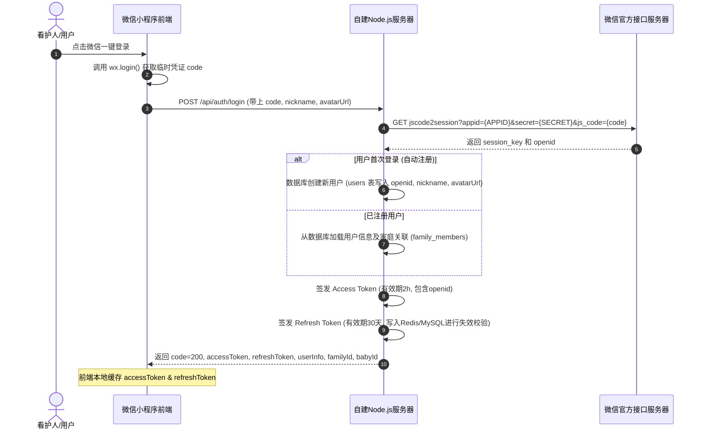

# 接口文档设计方案 (API Specification)

本接口文档定义了微信小程序“围兜日记”与自建 Node.js 后端进行数据交互的 RESTful API 规范。所有请求与响应数据均采用 JSON 格式，API 基准路径统一为 `/api`。

---

## 一、 统一响应格式封装 (Global Response Wrapper)

后端返回的数据无论成功还是失败，均采用相同的外部包装格式：

* **成功响应 (HTTP 200)**：
```json
{
  "code": 200,
  "message": "操作成功",
  "data": { ... } // 具体的业务数据负载
}
```
* **异常响应 (HTTP 4xx / 5xx)**：
```json
{
  "code": 400, // 对应的业务或系统错误码
  "message": "参数校验失败：宝宝姓名不能为空",
  "data": null
}
```

---

## 二、 微信授权登录与鉴权机制 (Auth & JWT Flow)

系统摒弃了云开发直接获取 OpenID 的依赖，采用符合行业标准的 **双 Token (Access Token + Refresh Token) 机制**。

### 1. 微信授权登录时序图 (Mermaid Sequence Diagram)



---

### 2. 授权登录 API 详情

#### 2.1 微信登录与授权注册 (`POST /auth/login`)
* **说明**：小程序通过 `wx.login` 获取的 `code` 进行服务端身份验证并注册/登录。
* **请求头**：`Content-Type: application/json`
* **请求体**：
```json
{
  "code": "033xxxxxyyyyzzzz1111",            // 微信临时 code (必填)
  "nickname": "轩轩妈",                       // 微信用户昵称 (选填，用于初始化)
  "avatarUrl": "https://thirdwx.qlogo.cn/..."  // 微信用户头像 (选填，用于初始化)
}
```
* **成功返回**：
```json
{
  "code": 200,
  "message": "登录成功",
  "data": {
    "accessToken": "eyJhbGciOiJIUzI1NiIsInR5cCI6IkpXVCJ9.eyJvcGVuaWQiOiJvX2d2d3g...", // 2小时失效
    "refreshToken": "eyJhbGciOiJIUzI1NiIsInR5cCI6IkpXVCJ9.ey...",                  // 30天失效
    "user": {
      "openid": "o_gvwx123456789abcde",
      "nickname": "轩轩妈",
      "avatarUrl": "https://thirdwx.qlogo.cn/..."
    },
    "familyId": "fam_8932470129", // 如果未绑定任何家庭，返回 null
    "babyId": "baby_uuid_992348"  // 如果未绑定任何宝宝，返回 null
  }
}
```

#### 2.2 Token 无感刷新接口 (`POST /auth/refresh`)
* **说明**：当 Access Token 过期时，小程序在后台静默使用 Refresh Token 换取新的 Access Token，避免用户被迫重新登录。
* **请求体**：
```json
{
  "refreshToken": "eyJhbGciOiJIUzI1NiIsInR5cCI6IkpXVCJ9.ey..." // 30天长效Token
}
```
* **成功返回**：
```json
{
  "code": 200,
  "message": "Token 刷新成功",
  "data": {
    "accessToken": "eyJhbGciOiJIUzI1NiIsInR5cCI6IkpXVCJ9.new_access_token_here",
    "refreshToken": "eyJhbGciOiJIUzI1NiIsInR5cCI6IkpXVCJ9.new_refresh_token_here" // 实行 Token 滑动过期
  }
}
```

---

## 三、 增量协同同步 API (Sync Management)

为了替换原先在微信小程序端调用 `syncPull` 与 `syncMerge` 云函数，设计了统一的增量数据交互接口。

### 1. 增量拉取数据 (`POST /sync/pull`)
* **说明**：拉取某一同步时间戳之后由家庭其他成员添加或修改的云端最新数据。
* **Headers**：`Authorization: Bearer <accessToken>`
* **请求体**：
```json
{
  "familyId": "fam_8932470129",
  "lastSyncTime": "2026-06-30T10:00:00.000Z", // 上次同步时间 (ISO格式)。如果是首次登录拉取，传空字符串
  "collections": ["milk_water_records", "bowel_records", "growth_records"] // 指定要增量同步的表，不传默认全量
}
```
* **成功返回**：
```json
{
  "code": 200,
  "message": "数据拉取成功",
  "data": {
    "syncTime": "2026-07-01T08:00:00.000Z", // 前端需要更新并保存此时间作为下次同步的起点
    "records": {
      "milk_water_records": [
        { "id": "milk_1", "date": "2026-07-01", "time": "08:30", "type": "milk", "amount": 180, "remark": "喝奶" }
      ],
      "bowel_records": [
        { "id": "bowel_1", "date": "2026-07-01", "time": "09:00", "color": "黄色", "shape": "糊状", "count": 1, "note": "" }
      ],
      "growth_records": []
    }
  }
}
```

### 2. 增量推送/覆盖同步 (`POST /sync/push`)
* **说明**：将本地离线记录或新加打卡记录覆盖写入云端，云端在处理时会自动根据 `id` (即 `sync_id`) 进行 `upsert` (存在即更新，不存在即添加) 并执行物理删除逻辑。
* **Headers**：`Authorization: Bearer <accessToken>`
* **请求体**：
```json
{
  "familyId": "fam_8932470129",
  "collection": "milk_water_records", // 当前推送的目标表名
  "records": [
    {
      "id": "milk_1", // 客户端生成的唯一 ID/时间戳
      "date": "2026-07-01",
      "time": "08:30",
      "type": "milk",
      "amount": 180,
      "remark": "修改饮奶量"
    }
  ]
}
```
* **成功返回**：
```json
{
  "code": 200,
  "message": "同步保存成功",
  "data": {
    "successCount": 1
  }
}
```

---

## 四、 辅食食谱校验 API (Meal Plan Validation)

移植了原云函数 `validateWeeklyPlan` 的复杂排敏及红肉分析计算，后端直接在 Service 层使用排敏水池中的数据对比分析。

### 1. 提交校验并保存周计划 (`POST /meal-plan/validate`)
* **说明**：提交某一周的食谱数据，由后端做安全校验与频次计算，并返回营养报告，自动持久化至 `meal_plans` 和 `meal_plan_days`。
* **Headers**：`Authorization: Bearer <accessToken>`
* **请求体**：
```json
{
  "babyId": "baby_uuid_992348",
  "weekNum": "2026W27",
  "startDate": "2026-06-29",
  "endDate": "2026-07-05",
  "days": [
    {
      "date": "2026-06-29",
      "dayName": "周一",
      "meals": {
        "breakfast": "蛋黄 + 小米粥",
        "lunch": "鳕鱼西兰花南瓜泥",
        "dinner": "猪肉香菇青菜烩饭",
        "snack": "苹果泥"
      },
      "note": "无异常"
    }
  ]
}
```
* **成功返回**：
```json
{
  "code": 200,
  "message": "食谱校验完成并已保存",
  "data": {
    "planId": "plan_uuid_897123",
    "validationReport": {
      "redMeatCount": 1,         // 红肉吃了几次
      "grainPercent": 25,        // 粗粮占比百分比
      "eggDays": 1,              // 吃鸡蛋的天数
      "hasBannedFood": false,    // 是否包含了违禁过敏食材
      "formatError": false,      // 命名格式是否有错误（如未使用符合规范的 + 号拼接）
      "bannedDetails": []        // 违禁食材明细 (如果有)
    }
  }
}
```
